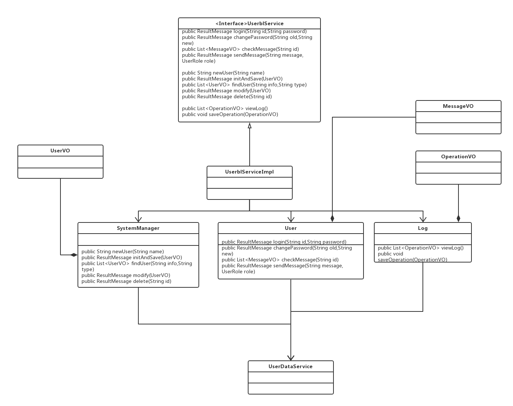
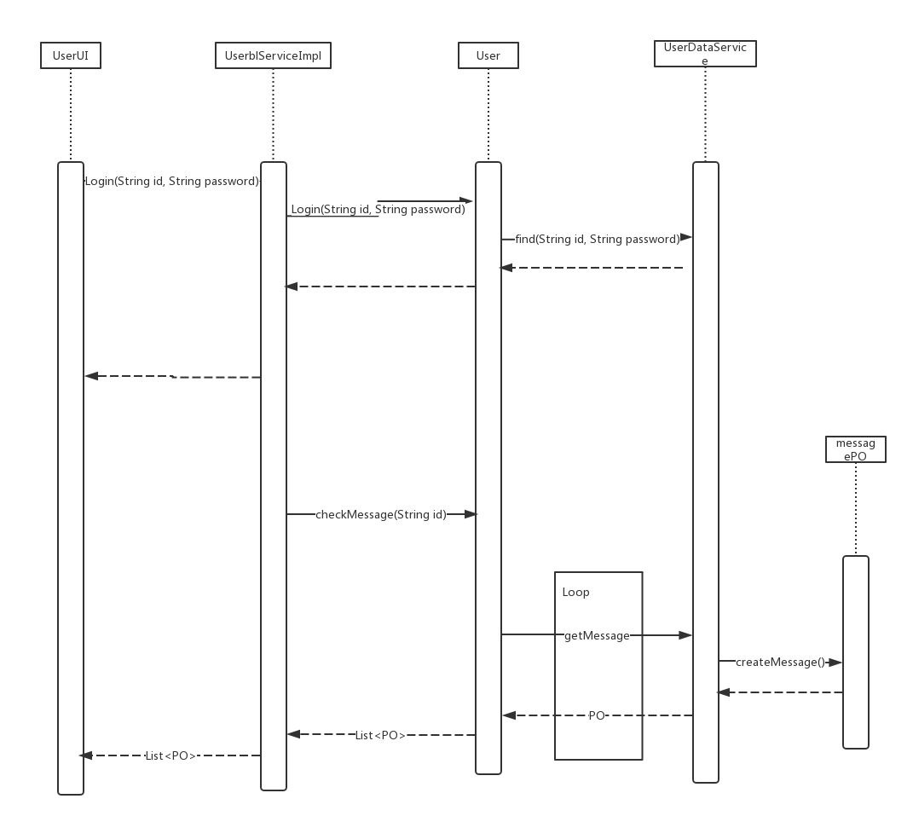

### 4.1.1 User 模块
#### （1）模块描述
Userbl模块承担的需求参见需求规格说明文档功能需求及相关非功能需求
Userbl模块的职责及接口参见软件系统体系结构描述文档

#### （2）整体结构
根据体系结构的设计，我们将系统分为展示层、业务逻辑层、数据层。每一层之间为了增加灵活性和可修改性，我们会添加接口。在展示层和业务逻辑层之间，我们添加UserBLService接口。业务逻辑层和数据层之间添加UserDataService接口。为了隔离业务逻辑职责和逻辑控制职责，我们添加了UserBLServiceImpl，这样UserBLServiceImpl会将对新建的业务逻辑处理委托给User和SystemManager和Log对象。UserPO是作为商品和商品分类信息的持久化对象被添加到设计模型中去的。 

Userbl模块的设计如图4.1.1-1 所示

&nbsp;&nbsp;&nbsp;&nbsp;&nbsp;&nbsp;&nbsp;&nbsp;&nbsp;&nbsp;&nbsp;&nbsp;&nbsp;&nbsp;&nbsp;&nbsp;&nbsp;&nbsp;&nbsp;&nbsp;&nbsp;&nbsp;&nbsp;&nbsp;&nbsp;&nbsp;&nbsp;&nbsp;&nbsp;&nbsp;&nbsp;&nbsp;&nbsp;&nbsp;&nbsp;&nbsp;&nbsp;&nbsp;&nbsp;&nbsp;&nbsp;&nbsp;&nbsp;&nbsp;&nbsp;&nbsp;&nbsp;&nbsp;&nbsp;&nbsp;&nbsp;&nbsp;&nbsp;&nbsp;&nbsp;&nbsp;&nbsp;&nbsp;&nbsp;&nbsp;&nbsp;&nbsp;&nbsp;&nbsp;&nbsp;&nbsp;&nbsp;&nbsp;&nbsp;&nbsp;&nbsp;&nbsp;&nbsp;&nbsp;&nbsp;&nbsp;&nbsp;&nbsp;&nbsp;&nbsp;&nbsp;&nbsp;&nbsp;&nbsp;&nbsp;&nbsp;&nbsp;&nbsp;&nbsp;&nbsp;&nbsp;&nbsp;&nbsp;&nbsp;&nbsp;&nbsp;&nbsp;&nbsp;&nbsp;
**图 4.1.1（1）-1 Userbl模块设计模型** 

表 4.1.1-1（2） Userbl模块各个类的职责 

模块 | 职责
---|---
UserBLServiceImpl | 管理Userbl各个类的任务
User | 完成系统用户所需的功能
SystemManager | 完成系统管理员所需的功能
Log | 完成日至有关的功能

#### （3）模块内部类的接口规范
UserBLServiceImpl 的接口规范如表4.1.1（3）-1所示。 
User的接口规范如表4.1.1（3）-2所示。 
SystemManager的接口规范如表4.1.1（3）-3所示。 
Log的接口规范如表4.1.1（3）-User所示。 

表4.1.1（3）-1 UserBLServiceImpl的接口规范

<table>
<tr>
<td colspan ="3">提供的服务（供接口）</td>
</tr>
<tr>
<td rowspan = "3">User.login</td>
<td>语法</td><td>public ResultMessage login(String id,String password)</td>
</tr>
<tr>
<td>前置条件</td><td>Password符合输入规则</td>
</tr>
<tr>
<td>后置条件</td><td>查找是否存在相应的User,根据输入的password返回登录验证的结果</td>
</tr>
<tr>
<td rowspan = "3">User.changePassword</td>
<td>语法</td><td>public ResultMessage changePassword(String old,String new)</td>
</tr>
<tr>
<td>前置条件</td><td>无</td>
</tr>
<tr>
<td>后置条件</td><td>若旧密码输入正确，则更新为新密码</td>
</tr>
<tr>
<td rowspan = "3">User.sendMessage</td>
<td>语法</td><td> public ResultMessage sendMessage(String message, UserRole role)</td>
</tr>
<tr>
<td>前置条件</td><td>无</td>
</tr>
<tr>
<td>后置条件</td><td>给指定角色的用户发送消息</td>
</tr>
<tr>
<td rowspan = "3">User.checkMessage</td>
<td>语法</td><td> public List<MessageVO> checkMessage(String id)</td>
</tr>
<tr>
<td>前置条件</td><td>用户已登录</td>
</tr>
<tr>
<td>后置条件</td><td>返回该用户的所有消息</td>
</tr>
<tr>
<td rowspan = "3">User.new</td>
<td>语法</td><td>public String newUser(String name)</td>
</tr>
<tr>
<td>前置条件</td><td>已输入新用户名称</td>
</tr>
<tr>
<td>后置条件</td><td>查找是否存在相同的User,若不存在，则返回新用户编号</td>
</tr>
<tr>
<td rowspan = "3">User.initAndSave</td>
<td>语法</td><td>public ResultMessage initAndSave(UserVO)</td>
</tr>
<tr>
<td>前置条件</td><td>password,level符合输入规则</td>
</tr>
<tr>
<td>后置条件</td><td>持久化保存新用户信息</td>
</tr>
<tr>
<td rowspan = "3">User.findUser</td>
<td>语法</td><td>public List<UserVO> findUser(String info,String type)</td>
</tr>
<tr>
<td>前置条件</td><td>无</td>
</tr>
<tr>
<td>后置条件</td><td>返回符合条件的用户列表</td>
</tr>
<tr>
<td rowspan = "3">User.modify</td>
<td>语法</td><td>public ResultMessage modify(UserVO)</td>
</tr>
<tr>
<td>前置条件</td><td>password,level符合输入规则</td>
</tr>
<tr>
<td>后置条件</td><td>持久化更新User的信息</td>
</tr>
<tr>
<td rowspan = "3">User.delete</td>
<td>语法</td><td>public ResultMessage delete(String id)</td>
</tr>
<tr>
<td>前置条件</td><td>无</td>
</tr>
<tr>
<td>后置条件</td><td>持久化删除User</td>
</tr>
<tr>
<td rowspan = "3">User.viewLog</td>
<td>语法</td><td>public List<OperationVO> viewLog()</td>
</tr>
<tr>
<td>前置条件</td><td> 经理或财务人员已登陆 </td>
</tr>
<tr>
<td>后置条件</td><td>返回日志信息</td>
</tr>
<tr>
<td rowspan = "3">User.saveOpertion</td>
<td>语法</td><td> public ResultMessage saveOperation(OperationVO)</td>
</tr>
<tr>
<td>前置条件</td><td>完成一个完整操作</td>
</tr>
<tr>
<td>后置条件</td><td>持久化保存操作记录</td>
</tr>
</table>

表4.1.1（3）-2 User的接口规范

<table>
<tr>
<td colspan ="3">提供的服务（供接口）</td>
</tr>
<tr>
<td rowspan = "3">User.login</td>
<td>语法</td><td>public ResultMessage login(String id,String password)</td>
</tr>
<tr>
<td>前置条件</td><td>Password符合输入规则</td>
</tr>
<tr>
<td>后置条件</td><td>查找是否存在相应的User,根据输入的password返回登录验证的结果</td>
</tr>
<tr>
<td rowspan = "3">User.changePassword</td>
<td>语法</td><td>public ResultMessage changePassword(String old,String new)</td>
</tr>
<tr>
<td>前置条件</td><td>无</td>
</tr>
<tr>
<td>后置条件</td><td>若旧密码输入正确，则更新为新密码</td>
</tr>
<tr>
<td rowspan = "3">User.sendMessage</td>
<td>语法</td><td> public ResultMessage sendMessage(String message, UserRole role)</td>
</tr>
<tr>
<td>前置条件</td><td>无</td>
</tr>
<tr>
<td>后置条件</td><td>给指定角色的用户发送消息</td>
</tr>
<tr>
<td rowspan = "3">User.checkMessage</td>
<td>语法</td><td> public List<MessageVO> checkMessage(String id)</td>
</tr>
<tr>
<td>前置条件</td><td>用户已登录</td>
</tr>
<tr>
<td>后置条件</td><td>返回该用户的所有消息</td>
</tr>
</table>

表4.1.1（3）-3 SystemManager 的接口规范
<table>
<tr>
<td colspan ="3">提供的服务（供接口）</td>
</tr>
<tr>
<td rowspan = "3">User.new</td>
<td>语法</td><td>public String newUser(String name)</td>
</tr>
<tr>
<td>前置条件</td><td>已输入新用户名称</td>
</tr>
<tr>
<td>后置条件</td><td>查找是否存在相同的User,若不存在，则返回新用户编号</td>
</tr>
<tr>
<td rowspan = "3">User.initAndSave</td>
<td>语法</td><td>public ResultMessage initAndSave(UserVO)</td>
</tr>
<tr>
<td>前置条件</td><td>password,level符合输入规则</td>
</tr>
<tr>
<td>后置条件</td><td>持久化保存新用户信息</td>
</tr>
<tr>
<td rowspan = "3">User.findUser</td>
<td>语法</td><td>public List<UserVO> findUser(String info,String type)</td>
</tr>
<tr>
<td>前置条件</td><td>无</td>
</tr>
<tr>
<td>后置条件</td><td>返回符合条件的用户列表</td>
</tr>
<tr>
<td rowspan = "3">User.modify</td>
<td>语法</td><td>public ResultMessage modify(UserVO)</td>
</tr>
<tr>
<td>前置条件</td><td>password,level符合输入规则</td>
</tr>
<tr>
<td>后置条件</td><td>持久化更新User的信息</td>
</tr>
<tr>
<td rowspan = "3">User.delete</td>
<td>语法</td><td>public ResultMessage delete(String id)</td>
</tr>
<tr>
<td>前置条件</td><td>无</td>
</tr>
<tr>
<td>后置条件</td><td>持久化删除User</td>
</tr>
</table>

表 4.1.1(3)-4 Log 的接口规范
<table>
<tr>
<td colspan ="3">提供的服务（供接口）</td>
</tr>
<tr>
<td rowspan = "3">User.viewLog</td>
<td>语法</td><td>public List<OperationVO> viewLog()</td>
</tr>
<tr>
<td>前置条件</td><td> 经理或财务人员已登陆 </td>
</tr>
<tr>
<td>后置条件</td><td>返回日志信息</td>
</tr>
<tr>
<td rowspan = "3">User.saveOpertion</td>
<td>语法</td><td> public ResultMessage saveOperation(OperationVO)</td>
</tr>
<tr>
<td>前置条件</td><td>完成一个完整操作</td>
</tr>
<tr>
<td>后置条件</td><td>持久化保存操作记录</td>
</tr>
</table>

#### (4)业务逻辑层的动态模型
图4.1.1（4）表明了进销存系统中，当用户登录以及查看消息时，商品业务逻辑处理的相关对象之间的协作。 

&nbsp;&nbsp;&nbsp;&nbsp;&nbsp;&nbsp;&nbsp;&nbsp;&nbsp;&nbsp;&nbsp;&nbsp;&nbsp;&nbsp;&nbsp;&nbsp;&nbsp;&nbsp;&nbsp;&nbsp;&nbsp;&nbsp;&nbsp;&nbsp;&nbsp;&nbsp;&nbsp;&nbsp;&nbsp;&nbsp;&nbsp;&nbsp;&nbsp;&nbsp;&nbsp;&nbsp;&nbsp;&nbsp;&nbsp;&nbsp;&nbsp;&nbsp;&nbsp;&nbsp;&nbsp;&nbsp;&nbsp;&nbsp;&nbsp;&nbsp;&nbsp;&nbsp;&nbsp;&nbsp;&nbsp;&nbsp;&nbsp;&nbsp;&nbsp;&nbsp;&nbsp;
**图4.1.1（4）登录和增加商品** 

其他的顺序图与此类似，在此不再赘述  
